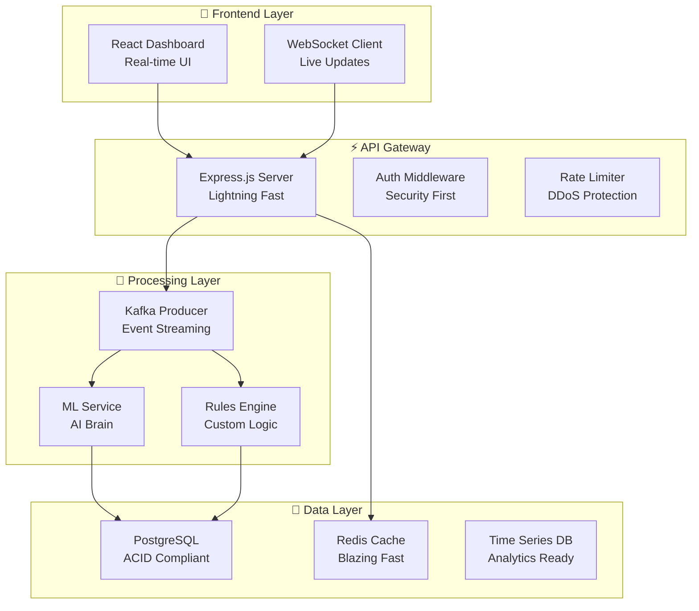

# 🎯 **FRAUD DETECTION SYSTEM**  
### *Because Your Money Deserves Better Bodyguards*

---

## 🚀 **The TL;DR**

Real-time fraud detection that stops bad guys in their tracks. Built with modern tech, scales like crazy, and looks damn good doing it.

---

## ✨ **Why This Is Different**

### 🧠 **Smart AI, Not Dumb Rules**
- **Isolation Forest ML** that learns what "normal" looks like
- **Real-time scoring** - catches fraud as it happens
- **Self-improving** - gets smarter with every transaction

### ⚡ **Built for Speed**
- **Sub-200ms response times** - fraud gets blocked before they finish typing
- **WebSocket magic** - live updates without refreshing
- **Kafka-powered** - handles millions of transactions without breaking a sweat

### 🛡️ **Enterprise-Grade Security**
- **JWT authentication** with military-grade encryption
- **Role-based access** - right people, right access
- **Audit trails** - every action logged and traceable

---

## 🏗️ **The Architecture Porn**



---

## 🛠️ **The Tech Stack (Curated with Love)**

### **Frontend Excellence**
- **React 18** + TypeScript - Type-safe, component-based perfection
- **Zustand** - State management that doesn't suck
- **TailwindCSS** - Utility-first CSS that scales
- **Recharts** - Beautiful data viz, zero effort

### **Backend Powerhouse**
- **Node.js 18** + Express - Fast, reliable, battle-tested
- **Prisma ORM** - Type-safe database magic
- **JWT + bcrypt** - Security that actually works
- **Winston** - Logging that makes sense

### **ML & AI**
- **Python 3.9** + FastAPI - ML serving at lightspeed
- **Scikit-learn** - Industry-standard ML algorithms
- **Isolation Forest** - Anomaly detection that works
- **Real-time scoring** - No batch processing BS

### **Infrastructure Gods**
- **Docker** - Containerize everything
- **Kafka** - Event streaming champion
- **PostgreSQL** - Data integrity guaranteed
- **Redis** - Caching that makes users happy
- **Prometheus/Grafana** - Monitoring that prevents 3AM calls

---

## 🚀 **Get This Beast Running**

### **Prerequisites (Don't Skip This)**
```bash
# Docker & Docker Compose (Non-negotiable)
docker --version && docker-compose --version

# Node.js 18+ (For local dev)
node --version

# Git (Obviously)
git --version
```

### **The Easy Button** 🎯
```bash
# Clone this masterpiece
git clone <your-repo-url>
cd fraud-detection-system

# Copy the good stuff
cp .env.example .env
# Edit .env with your secrets (don't commit these!)

# Fire it up! 🔥
./scripts/setup.sh
```

### **Access Your New Powers**
- **Dashboard**: http://localhost:3000 - The money view
- **API**: http://localhost:4000 - The engine room
- **ML Service**: http://localhost:8000 - The brain
- **Grafana**: http://localhost:3001 - The health monitor

---

## 📊 **What You Get**

### **Real-Time Monitoring** 📈
- **Live transaction feed** - Watch money move in real-time
- **Instant fraud alerts** - Get notified before damage happens
- **Geographic risk maps** - See fraud hotspots globally
- **Performance metrics** - Know your system's pulse

### **Analytics That Matter** 📊
- **Fraud trend analysis** - Spot patterns before attackers do
- **Merchant risk scoring** - Know who to trust
- **Capture rate metrics** - Measure your effectiveness
- **Custom time ranges** - Analyze any period you want

### **Rules Engine** ⚙️
- **Visual rule builder** - No coding required
- **Real-time rule updates** - Deploy without downtime
- **Severity-based alerts** - Focus on what matters
- **Historical performance** - Learn from past rules

---

## 🔧 **For the Developers**

### **Local Development Setup**
```bash
# Backend (The Powerhouse)
cd apps/api-server
npm install && npm run dev

# Frontend (The Pretty Face)
cd apps/frontend
npm install && npm run dev

# ML Service (The Brain)
cd apps/ml-service
pip install -r requirements.txt
uvicorn main:app --reload
```

### **Database Magic**
```bash
# Generate Prisma client
npx prisma generate

# Run migrations
npx prisma migrate dev

# Seed with sample data
npx prisma db seed

# Visual database explorer
npx prisma studio
```

---

## 🚀 **Production Deployment**

### **The One-Command Wonder**
```bash
# Deploy to production (like a boss)
./scripts/deploy.sh
```

---

## 🔒 **Security That Matters**

### **Authentication & Authorization**
- **JWT tokens** with configurable expiration
- **Role-based access** (Admin, Analyst, Viewer)
- **Secure password hashing** with bcrypt
- **Session management** with Redis

---

## � **Documentation That Doesn't Suck**

- **[API Documentation](./docs/API.md)** - Every endpoint, every example
- **[Deployment Guide](./docs/DEPLOYMENT.md)** - Production deployment, step-by-step
- **[Architecture Overview](./docs/ARCHITECTURE.md)** - System design and data flow
- **[Troubleshooting Guide](./docs/TROUBLESHOOTING.md)** - Common issues, quick fixes

---

## 🤝 **Contributing (Join the Dark Side)**

1. **Fork** this repository
2. **Create** a feature branch (`git checkout -b feature/amazing-feature`)
3. **Code** like you mean it
4. **Test** like you care
5. **Submit** a pull request with a clear description

---

## � **License (The Legal Stuff)**

This project is licensed under **MIT License** - see the [LICENSE](LICENSE) file for details.

In plain English: **Do whatever you want, but don't blame us if it breaks.**

---

## 🆘 **Need Help? We Got You.**

### **Self-Service First**
1. **Check the docs** - 90% of questions are answered there
2. **Search issues** - Someone probably asked before
3. **Check the troubleshooting guide** - Quick fixes for common problems

### **When All Else Fails**
- **Create an issue** with:
  - **Detailed description** - What happened, what you expected
  - **Steps to reproduce** - Help us help you
  - **Environment info** - OS, versions, etc.
  - **Error logs** - The full story

---
```bash
# Build production images
docker-compose -f docker-compose.prod.yml build

# Deploy with scaling
docker-compose -f docker-compose.prod.yml up -d --scale api-server=3
```

## 🤝 Contributing

1. Fork the repository
2. Create a feature branch
3. Make your changes
4. Add tests for new functionality
5. Run the test suite
6. Submit a pull request

## 📝 License

This project is licensed under the ISC License.

## 🆘 Support

For issues and questions:
- Create an issue in the repository
- Check the logs for error details
- Review the API documentation
- Ensure all services are running

## 🔮 Future Enhancements

- [ ] Advanced ML models (LSTM, Autoencoders)
- [ ] Real-time analytics dashboard
- [ ] Mobile application
- [ ] Multi-tenant support
- [ ] Advanced reporting engine
- [ ] Integration with payment processors
- [ ] Behavioral biometrics
- [ ] Geographic IP intelligence
- [ ] Device fingerprinting
