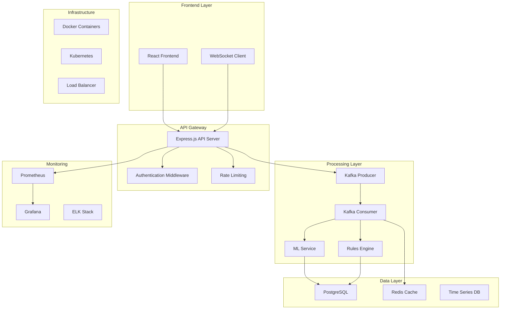
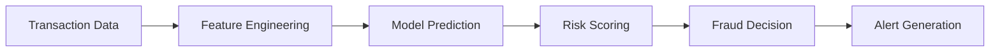
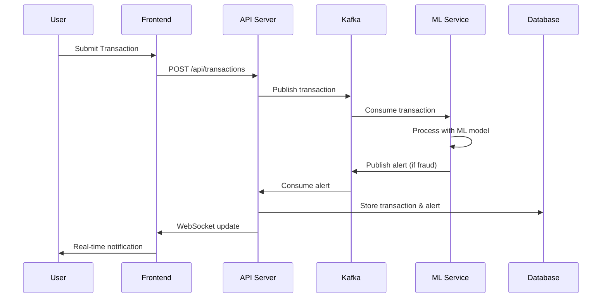
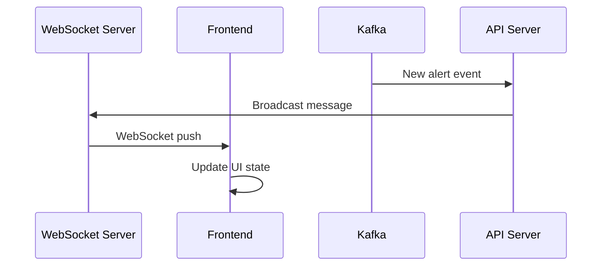
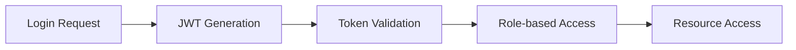
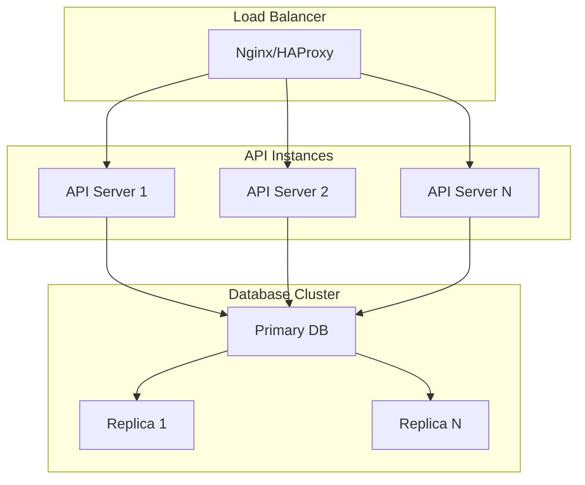
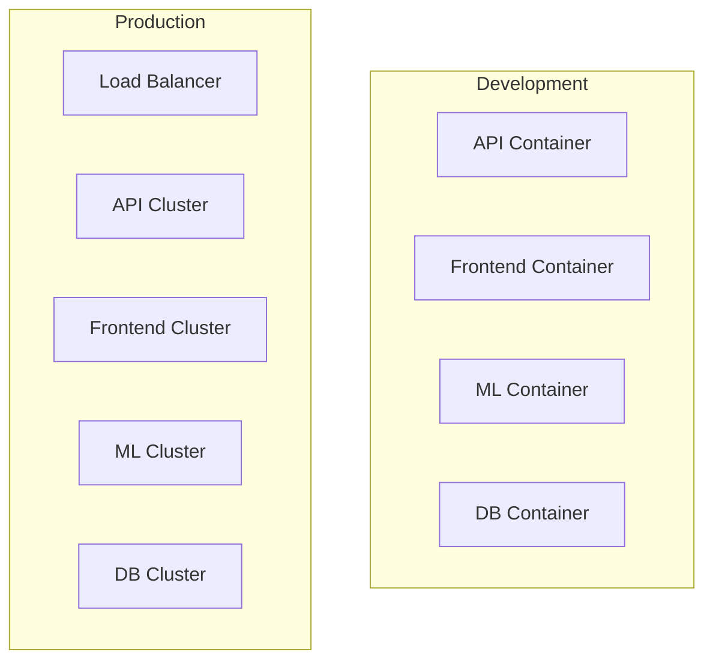

# Fraud Detection System Architecture

## Overview

The Fraud Detection System is a real-time, scalable platform for detecting and preventing fraudulent transactions. It uses a microservices architecture with event-driven processing, machine learning, and comprehensive monitoring.

## System Architecture

## Components

### 1. Frontend Application

**Technology Stack:**
- React 18 with TypeScript
- Zustand for state management
- TailwindCSS for styling
- Recharts for data visualization
- WebSocket for real-time updates

**Features:**
- Real-time dashboard
- Transaction monitoring
- Alert management
- Analytics and reporting
- User management

### 2. API Server

**Technology Stack:**
- Node.js with Express.js
- TypeScript for type safety
- Prisma ORM for database operations
- JWT for authentication
- Helmet for security headers

**Key Modules:**
- Authentication & Authorization
- Transaction Processing
- Alert Management
- Rules Engine
- Analytics API

### 3. Machine Learning Service

**Technology Stack:**
- Python with FastAPI
- Scikit-learn for ML models
- NumPy/Pandas for data processing
- Joblib for model persistence

**ML Pipeline:**

**Models:**
- Isolation Forest for anomaly detection
- Logistic Regression for classification
- Custom ensemble methods
- Real-time model updates

### 4. Message Queue (Kafka)

**Topics:**
- `transactions`: Raw transaction data
- `alerts`: Fraud detection alerts
- `metrics`: System performance metrics
- `model-updates`: ML model updates

**Benefits:**
- Decoupled services
- Fault tolerance
- Scalability
- Event replay capability

### 5. Database Layer

**PostgreSQL (Primary Database):**
- User data and authentication
- Transaction records
- Fraud alerts
- Rules and configurations
- Audit logs

**Redis (Cache Layer):**
- Session management
- Real-time metrics
- Frequently accessed data
- Rate limiting counters

### 6. Monitoring & Observability

**Prometheus:**
- Metrics collection
- Custom application metrics
- Infrastructure monitoring
- Alert rules

**Grafana:**
- Data visualization
- Dashboard creation
- Alert management
- Performance analysis

## Data Flow

### Transaction Processing Flow

### Real-time Updates Flow

## Security Architecture

### Authentication & Authorization

**Security Measures:**
- JWT tokens with expiration
- Password hashing with bcrypt
- Rate limiting per endpoint
- CORS configuration
- Security headers (Helmet)
- Input sanitization

### Data Protection

- **Encryption**: TLS 1.3 for all communications
- **Hashing**: bcrypt for passwords
- **Tokens**: JWT with RS256 signing
- **Audit**: Complete audit trail
- **Compliance**: GDPR/PCI-DSS ready

## Scalability Architecture

### Horizontal Scaling

### Scaling Strategies

**API Layer:**
- Stateless design for easy scaling
- Load balancer distribution
- Auto-scaling based on metrics
- Container orchestration

**Database Layer:**
- Read replicas for query scaling
- Connection pooling
- Database sharding (future)
- Caching layer

**Message Queue:**
- Kafka partitioning
- Consumer groups
- Topic replication
- Horizontal scaling

## Performance Considerations

### Response Time Optimization

- **Database Indexes**: Strategic indexing for queries
- **Caching Strategy**: Multi-level caching
- **Connection Pooling**: Efficient resource usage
- **Async Processing**: Non-blocking operations

### Throughput Optimization

- **Batch Processing**: Group operations
- **Parallel Processing**: Concurrent execution
- **Message Batching**: Kafka batch size optimization
- **Resource Monitoring**: Real-time performance tracking

## Deployment Architecture

### Container Strategy

### Orchestration

- **Development**: Docker Compose
- **Production**: Kubernetes
- **CI/CD**: GitHub Actions
- **Infrastructure as Code**: Terraform

## Monitoring & Observability

### Metrics Collection

**Application Metrics:**
- Request rate and latency
- Error rates by endpoint
- User activity metrics
- Business KPIs

**Infrastructure Metrics:**
- CPU and memory usage
- Network I/O
- Disk usage
- Container health

### Alerting Strategy

**Critical Alerts:**
- Service downtime
- High error rates
- Database connection issues
- Security events

**Warning Alerts:**
- Performance degradation
- Resource threshold breaches
- Queue backlogs

## Future Enhancements

### Planned Features

1. **Advanced ML Models**
   - Deep learning integration
   - Real-time model training
   - A/B testing framework

2. **Enhanced Security**
   - Multi-factor authentication
   - Advanced threat detection
   - Zero-trust architecture

3. **Performance Improvements**
   - GraphQL API
   - Edge computing
   - Advanced caching strategies

### Technology Evolution

- **Microservices**: More granular service separation
- **Event Sourcing**: Complete event history
- **CQRS**: Command Query Responsibility Segregation
- **Serverless**: Function-based architecture

## Documentation

- [API Documentation](./API.md)
- [Deployment Guide](./DEPLOYMENT.md)
- [Development Setup](../README.md)
- [Troubleshooting Guide](./TROUBLESHOOTING.md)
